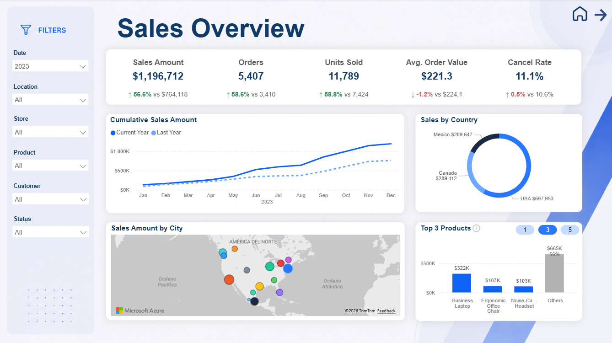
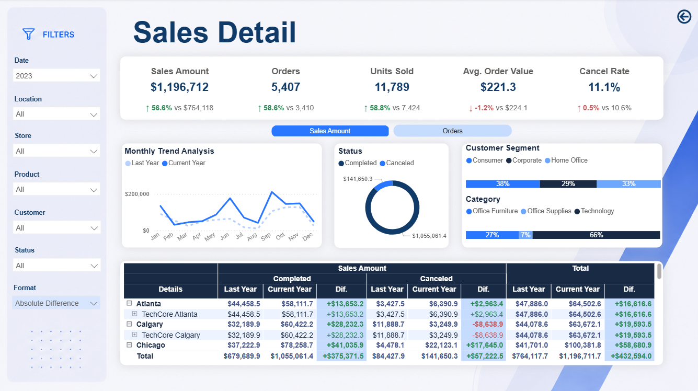

# 📊 Sales Insights — Power BI Report


---

> **Business analytics report** for TechCore, a North American tech retail chain with 15 stores across the USA, Canada, and Mexico. Covers sales performance from 2020 to 2025 with trend analysis, product rankings, geographic distribution, and built-in time intelligence — all version-controlled in the `.pbip` flat-file format.

---

## 🖼️ Dashboard Preview

[▶️ Watch Full Demo](./Media/Full%20demo.mp4)

---

## ✨ Key Features

### 📈 Year-over-Year Trend Analysis
Cumulative line chart comparing the current year vs. the previous year month by month, with YoY % in tooltip. Powered by `DATESYTD` and `SAMEPERIODLASTYEAR` time intelligence functions.

---

### 🏆 Dynamic Top N Ranking
Configurable product ranking via a parameter slicer. The chart title, Y-axis ceiling, and "Others" bar all update automatically with the selected N value.

---

### 🗺️ Interactive Bubble Map
15 store locations across North America sized by Sales Amount. Each bubble is color-coded per city with a theme-compatible palette. Tooltip shows Orders and Cancel Rate.

---

### 💳 KPI Cards with Dynamic Format
Five key metrics — Sales Amount, Orders, Units Sold, Average Order Value, and Cancel Rate — each showing the YoY change. A toggle slicer switches between absolute (`#`) and percentage (`%`) display on the cards.

---

### 🍩 Category Sales Donut
Revenue share per product category with cross-filtering to the Top N chart and the bubble map.

---

### 🔍 Drillthrough Detail Page
Right-click any **Category**, **Product**, or **Store Location** to drill into a granular breakdown. The detail page shows sales split by customer segment and by store location, with a field parameter to switch the displayed metric.

---

### 🔒 Row-Level Security (RLS)
Two security roles control what data each user sees:

| Role | Logic |
|------|-------|
| `Filter Seller by User Principal` | Filters `dim_employees` — sellers see only their own row; managers see all |
| `Filter Seller by Sales Region` | Filters `fact_sales` — sellers see only transactions from their assigned store; managers see all |

---

## 📄 Report Pages

### 🏠 Cover
Branded landing page with a custom background image, report title, and navigation buttons to the main pages.


---

### 📊 Sales *(main dashboard)*
The core analytics view. All slicers sync with the Detail page.



| Visual | Type | Description |
|--------|------|-------------|
| KPI Cards | Card | Sales Amount, Orders, Units Sold, AOV, Cancel Rate — each with a YoY badge and `#` / `%` format toggle |
| Cumulative Trend | Line Chart | Current year (solid) vs. previous year (dashed), month by month |
| Sales by Category | Donut Chart | Revenue share per category — cross-filters map and Top N chart |
| Top N Products | Column Chart | Dynamic ranking by sales with configurable N, auto-updating title and Y-axis |
| Sales Amount by Location | Bubble Map | 15 North American stores sized by revenue, with per-city colors |

**Slicers:** `Date (Year / Month)` · `Product (Category / Product)` · `Customer (Segment / Customer)`

---

### 🔍 Detail *(drillthrough)*
Accessible from the Sales page by right-clicking any **Category**, **Product**, or **Store Location**, or via the navigation arrow in the top-right corner of the report.



| Visual | Type | Description |
|--------|------|-------------|
| By Customer Segment | 100% Stacked Bar | Sales split across Consumer, Corporate, and Home Office |
| By Location | 100% Stacked Bar | Sales comparison across store locations |
| Metric Selector | Slicer | Field parameter to switch between Sales Amount, Orders, Units Sold, etc. |

---

## 📐 Semantic Model

Star schema with one fact table connected to six dimension tables and three helper/parameter tables.

```
dim_calendar  ──┐
dim_products  ──┤
dim_customers ──┤──► fact_sales
dim_stores    ──┤
dim_employees ──┤
dim_status    ──┘
```

### Tables

| Table | Type | Description |
|-------|------|-------------|
| `fact_sales` | Fact | ~22,700 transactions (2020–2025). Columns: TransactionDate, Quantity, UnitPrice, TotalAmount + FK keys |
| `dim_calendar` | Dimension | Daily grain, Jan 2020 – Dec 2025. Year, Month, MonthShort, Quarter, DayOfWeek, IsWeekend |
| `dim_products` | Dimension | Products with Category and Brand |
| `dim_customers` | Dimension | Customers with Segment (Consumer · Corporate · Home Office) |
| `dim_stores` | Dimension | 15 stores with Location, City, State, Country, Lat, Long |
| `dim_employees` | Dimension | Active employees with Role, IsManager, Email, Tenure, Salary, JoinDate |
| `dim_status` | Dimension | Order statuses (Completed, Canceled, Pending…) with sort order and cancel reason |
| `@Measures` | Measures table | All DAX measures centralized in a single table |
| `aux_products` | Helper | Disconnected product list for Top N ALLSELECTED logic |
| `aux_topN` | Parameter | Controls the N value in the Top N slicer |
| `aux_format` | Parameter | Switches KPI card format between `#` and `%` |
| `Parameter Sales` | Field parameter | Switches the metric displayed in the Detail page charts |

### Relationships

| From | To | Direction |
|------|----|-----------|
| `fact_sales[FK_Customer]` | `dim_customers[PK_Customer]` | Single |
| `fact_sales[FK_Product]` | `dim_products[PK_Product]` | Single |
| `fact_sales[FK_Store]` | `dim_stores[PK_Store]` | Single |
| `fact_sales[FK_Employee]` | `dim_employees[PK_Employee]` | Single |
| `fact_sales[FK_Status]` | `dim_status[PK_Status]` | Single |
| `fact_sales[TransactionDate]` | `dim_calendar[Date]` | Single |
| `aux_products[Product]` | `dim_products[Product]` | **Both** |

---

## 🧮 DAX Measures

All measures are centralized in `@Measures` and organized in display folders.

### `KPIs \ Main`
| Measure | Format | Description |
|---------|--------|-------------|
| `Sales Amount` | `$#,0.0` | Total revenue (`SUM` of TotalAmount) |
| `Orders` | `#,0` | Distinct order count |
| `Units Sold` | `#,0` | Total quantity sold |
| `Average Order Value` | `$#,0.0` | Sales Amount ÷ Orders |
| `Cancel Rate` | `0.0%` | Canceled orders ÷ total orders |
| `Canceled Orders` | `#,0` | Orders with status = "Canceled" |
| `Cumulative Sales Amount` | `$#,0.0` | YTD sales capped at last transaction date |

### `KPIs \ Time Intelligence \ LY`
| Measure | Description |
|---------|-------------|
| `LY \| Sales Amount` | Sales Amount in the same period last year |
| `LY \| Orders` | Orders in the same period last year |
| `LY \| Units Sold` | Units Sold in the same period last year |
| `LY \| Average Order Value` | AOV in the same period last year |
| `LY \| Cancel Rate` | Cancel Rate in the same period last year |
| `LY \| Cumulative Sales Amount` | YTD sales for the same period last year |

### `KPIs \ Time Intelligence \ YoY %`
| Measure | Description |
|---------|-------------|
| `YoY % \| Sales Amount` | `(Current − LY) / LY` for Sales Amount |
| `YoY % \| Orders` | `(Current − LY) / LY` for Orders |
| `YoY % \| Units Sold` | `(Current − LY) / LY` for Units Sold |
| `YoY % \| Average Order Value` | `(Current − LY) / LY` for AOV |
| `YoY % \| Cancel Rate` | `Current − LY` for Cancel Rate (percentage point delta) |
| `YoY % \| Cumulative Sales Amount` | `(Current − LY) / LY` for cumulative YTD sales |

### `KPIs \ Time Intelligence \ YoY #`
| Measure | Description |
|---------|-------------|
| `YoY # \| Sales Amount` | Absolute difference vs. last year |
| `YoY # \| Orders` | Absolute difference vs. last year |
| `YoY # \| Units Sold` | Absolute difference vs. last year |
| `YoY # \| Average Order Value` | Absolute difference vs. last year |

### `Format` — visual helpers
| Measure | Description |
|---------|-------------|
| `Top N Sales` | Sales Amount filtered to the Top N products; computes "Others" for the remaining bar |
| `Rank` | Dense rank by Sales Amount within the Top N selection |
| `Detail Other (%)` | Share of sales outside the Top N — shown only on the "Others" bar |
| `Graph Max: Top N Products` | Dynamic Y-axis ceiling (Others × 1.2) to prevent chart clipping |
| `Card: Top N Products` | Dynamic card title: `"Top N Products"` |
| `UI \| Format Orders` | SWITCH: YoY `#` or `%` for Orders card badge |
| `UI \| Format Sales Amount` | SWITCH: YoY `#` or `%` for Sales Amount card badge |
| `UI \| Color Top N Products` | Conditional color: `#0F63F4` for ranked products, `#B3B3B3` for "Others" |

---

## ✅ Best Practices Applied

### Data Model
- **Star schema** — single fact table, all dimensions connected via surrogate keys
- **PK/FK columns hidden** — `isHidden` set on all primary and foreign key columns across all tables
- **`isKey` flag** on every primary key column
- **No implicit date hierarchy** — `discourageImplicitMeasures` enabled; a clean `dim_calendar` is used instead of auto-generated hierarchies
- **Correct data types in TMDL** — `int64`, `decimal`, `double`, `boolean`, `dateTime`, `string` declared explicitly per column
- **Data types sourced correctly** — ISO 8601 dates (`yyyy-mm-dd`), floats for Lat/Long, `TRUE`/`FALSE` booleans written directly in CSVs to minimize Power Query type steps

### DAX & Measures
- **All measures centralized** in a single `@Measures` table — no measures scattered across dimension tables
- **Display folders** — measures organized in `KPIs\Main`, `KPIs\Time Intelligence\LY`, `KPIs\Time Intelligence\YoY %`, `KPIs\Time Intelligence\YoY #`, and `Format`
- **Consistent format strings** — all monetary measures use `$#,0.0`, percentages use `0.0%`, no "Auto" format strings left
- **LY measures isolated** as intermediate steps — consumed by YoY % and YoY # to avoid code duplication

### Security
- **Row-Level Security (RLS)** with two roles:
  - *Filter Seller by User Principal* — employee-level data isolation using `USERPRINCIPALNAME()`
  - *Filter Seller by Sales Region* — transaction-level isolation by store assignment

### Localization
- **Primary culture: `es-MX`** — model-level culture and Q&A linguistic metadata
- **Fallback culture: `en-US`** — Q&A synonyms registered for all main measures and dimension tables (revenue, transactions, cancellation rate, etc.)

### Report / UX
- **Theme colors consistent** throughout — primary `#2976FF`, navy `#192A44`, accent palette for map markers
- **Slicer font size** defaulted to 10 pt via theme JSON
- **Hidden pages** — Sales and Detail pages use `HiddenInViewMode`; navigation is controlled via Cover page buttons

---

## 🗄️ Dataset

Synthetic data generated with Python (`generate_data.py`). Realistic sales patterns across 6 years.

| Table | Rows |
|-------|------|
| `fact_sales` | ~22,700 transactions |
| `dim_calendar` | 2,192 dates (Jan 2020 – Dec 2025) |
| `dim_products` | Varies by category |
| `dim_customers` | Multiple segments |
| `dim_stores` | 15 stores |
| `dim_employees` | Active employees only |
| `dim_status` | 4 statuses |

**Seasonality modeled:**
- Monthly demand weights ranging from `0.22` (August, low season) to `2.50` (September/November, peak season) — an 11× spread
- Year growth trend: `2020 → 0.62` through `2025 → 1.42`
- COVID-19 overrides for March–May 2020 (demand dropped to 25–55%)
- Alternating pattern: July/August crash in even years, normal in odd years
- ±35% year-month random noise for realistic inter-year variation

**Stores — North America:**

| Region | Cities |
|--------|--------|
| USA | New York, Los Angeles, Chicago, Houston, Miami, Seattle, Atlanta, Denver |
| Canada | Toronto, Vancouver, Montreal, Calgary |
| Mexico | Mexico City, Guadalajara, Monterrey |

---

## 🚀 Getting Started

1. **Clone** this repository
   ```bash
   git clone https://github.com/monicaruizvaldez/pbi-sales-insights.git
   ```
2. **Verify the data path** — the `Path` shared expression in `expressions.tmdl` auto-detects the `Dataset\` folder by scanning common clone locations (`GitHub\`, `Documents\GitHub\`, `repos\`, etc.). If your repo is cloned elsewhere, open `expressions.tmdl` and replace the `Path` value with the absolute path to the `Dataset\` folder:
   ```
   C:\Users\<YourUser>\<YourFolder>\pbi-sales-insights\Dataset\
   ```
3. **Open** `Sales Insights.pbip` in Power BI Desktop (v2.138+ with `.pbip` support)
4. **Refresh** the semantic model
5. **Publish** to Power BI Service when ready — assign RLS role members after publishing

---

## ⚙️ Technical Details

| Item | Value |
|------|-------|
| Format | `.pbip` flat-file (Fabric / Power BI Desktop) |
| PBI Desktop version | v2.154.956.0 (May 2026) |
| Theme | Custom `Sales_Insights_Theme` — `#2976FF` · `#192A44` · `#4F8CFF` · `#7C8BA1` |
| Model culture | `es-MX` (primary) · `en-US` (fallback) |
| Data period | Jan 2020 – Dec 2025 |
| Default filter | Year = 2023 |
| RLS | ✅ 2 roles (User Principal + Sales Region) |
| Cross-filtering | ✅ Category donut ↔ Top N chart ↔ bubble map |
| Drillthrough | ✅ Category / Product / Location → Detail page |
| Slicer sync | ✅ Date, Category, Segment — Sales ↔ Detail |

---

## 🗂️ Repository Structure

```
pbi-sales-insights/
├── Sales Insights.pbip                        # Project entry point
├── README.md
├── .gitignore
├── Dataset/                                   # Source CSV files (7 tables)
│   ├── fact_sales.csv
│   ├── dim_calendar.csv
│   ├── dim_products.csv
│   ├── dim_customers.csv
│   ├── dim_stores.csv
│   ├── dim_employees.csv
│   └── dim_status.csv
├── Media/                                     # Screenshots + demo video
│   ├── Cover.png
│   ├── Sales.png
│   ├── Detail.png
│   └── Full demo.mp4
│
├── Sales Insights.Report/
│   ├── definition.pbir
│   ├── definition/
│   │   ├── report.json                        # Report-level settings & theme reference
│   │   ├── version.json
│   │   ├── bookmarks/                         # Saved bookmark states
│   │   └── pages/
│   │       ├── afe64a0fe386367750c1/          # Cover page
│   │       ├── b1b8dce499452b070516/          # Sales page (main dashboard)
│   │       └── 555ff4bd63cdc8ab01c2/          # Detail page (drillthrough)
│   └── StaticResources/
│       └── RegisteredResources/               # Theme JSON + background images
│
└── Sales Insights.SemanticModel/
    ├── definition.pbism
    ├── diagramLayout.json                     # Relationship diagram layout
    └── definition/
        ├── model.tmdl                         # Model-level config (culture, references)
        ├── database.tmdl
        ├── relationships.tmdl
        ├── expressions.tmdl                   # Dynamic path expression (auto-detects Dataset\)
        ├── tables/                            # One .tmdl per table
        │   ├── @Measures.tmdl                 # All 31 DAX measures
        │   ├── fact_sales.tmdl
        │   ├── dim_calendar.tmdl
        │   ├── dim_products.tmdl
        │   ├── dim_customers.tmdl
        │   ├── dim_stores.tmdl
        │   ├── dim_employees.tmdl
        │   ├── dim_status.tmdl
        │   ├── aux_products.tmdl
        │   ├── aux_topN.tmdl
        │   ├── aux_format.tmdl
        │   └── Parameter Sales.tmdl
        ├── cultures/
        │   ├── es-MX.tmdl                     # Primary culture + Q&A metadata
        │   └── en-US.tmdl                     # Fallback culture + English synonyms
        └── roles/
            ├── Filter Seller by User Principal.tmdl
            └── Filter Seller by Sales Region.tmdl
```

*Built with Power BI Desktop in `.pbip` format for full version control with Git.*
